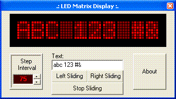

## LED Matrix Display v1\.2 \(Real\)

### Description

Your text shows in LED Matrix Display (Simulator). In this progam, there is 10 chars, but You can add UNLIMITED aumountof chars. (Medium commented) :)
 
### More Info
 

             |
---                |---
**Submitted On**   |2005-06-16 22:03:26
**By**             |[Edgars Priede](https://github.com/Planet-Source-Code/PSCIndex/blob/master/ByAuthor/edgars-priede.md)
**Level**          |Intermediate
**User Rating**    |5.0 (20 globes from 4 users)
**Compatibility**  |VB 5\.0, VB 6\.0
**Category**       |[Graphics](https://github.com/Planet-Source-Code/PSCIndex/blob/master/ByCategory/graphics__1-46.md)
**World**          |[Visual Basic](https://github.com/Planet-Source-Code/PSCIndex/blob/master/ByWorld/visual-basic.md)
**Archive File**   |[LED\_Matrix1902486162005\.zip](https://github.com/Planet-Source-Code/edgars-priede-led-matrix-display-v1-2-real__1-61188/archive/master.zip)

